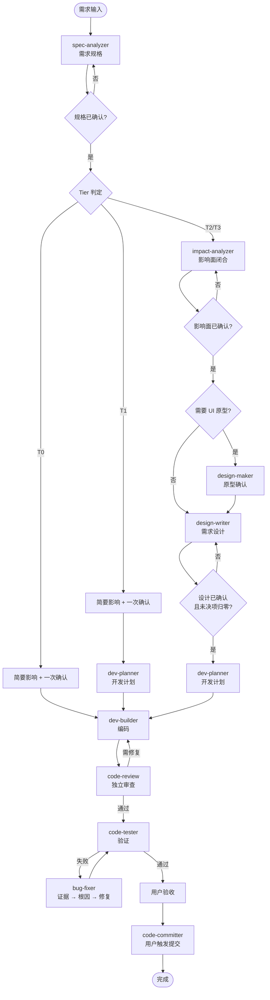

# DevFlow 1.1.1

DevFlow 是一套安装到 Git 项目中的 Claude Code 开发工作流，用于让 AI 面向日常迭代稳定完成开发：不偏离需求、不遗漏影响面、不过度开发，并能在中断后继续执行。

核心用法：

```text
python scripts/devflow.py install --target F:\Dev\TargetProject
重启 Claude Code，使自定义 Skill、子 Agent 和 hooks 生效
Claude 会先恢复状态，并主动汇报当前迭代与下一步
```

Claude Code 会自动加载根目录 `CLAUDE.md` 与 `.claude/CLAUDE.md`，安装后重启即可生效。完整调度规则在 `.claude/CLAUDE.md`，本文档面向人类快速理解。

---

## 一句话定位

```text
按需求规格确认事实、按影响面锁定范围；用 T0-T3 分级控制流程深度，用开发计划逐任务执行，用独立子 Agent 控制编码与审查，用指纹凭据守住提交门禁。
```

## 工作流特点

- **质量优先**：开发前确认需求和影响范围，开发后执行独立审查与验证，减少理解偏差和遗漏。
- **轻重适配**：按 T0-T3 调整流程深度，小改动保持轻量，复杂需求补足影响面和详细设计。
- **尊重项目事实**：优先使用项目文档、现有架构和源码证据，不让 AI 自行推断业务与模块边界。
- **可持续执行**：任务、阻塞和验证状态文件化，跨会话或中途切换后可以继续推进。
- **人工控制关键方向**：需要业务判断的阶段由用户确认，编码、审查和测试尽量自动完成。
- **保护现有项目**：保留用户已有修改和项目定制，升级、审查及提交均有明确保护边界。

## 适用场景

适合使用 Git、由 AI 参与日常迭代的 C/C++、Qt、Web、服务端或混合技术栈项目，尤其适合：

- 需求涉及多个模块、接口、数据、UI 或持久化。
- 开发任务可能跨会话执行或中途切换。
- 希望前三轮关键文档由人确认，后续开发尽量自动推进。
- 需要保留独立代码审查、人工验收和提交门禁。

以下工作不会启动需求迭代：

- 代码解释、方案讨论、只读排查、文档评审和状态查询。
- 不改变既有预期的普通 Bug 修复。
- 纯格式、注释或不改变产品行为的短时维护。

DevFlow 不替代项目管理平台、产品决策和人工验收。一次性脚本、纯探索原型或无须留存状态的极短任务通常无需使用。

## 组成

| 组成 | 用途 |
|---|---|
| `.claude/CLAUDE.md` | 调度入口、等级判断、阶段流转和恢复规则 |
| `.claude/skills/` | 需求、影响面、UI、设计、计划、编码、审查、测试和提交流程 |
| `.claude/agents/` | 独立编码与代码审查 Agent |
| `.claude/constraints/` | 默认编码、日志和目录规范 |
| `.claude/progress.json` | 当前迭代、任务、阻塞和待办输入 |
| `.claude/hooks/` | 提交前审查覆盖与构建检查 |
| `scripts/devflow.py` | 安装、检查和升级 DevFlow |

需求、设计、计划和测试文档生成在目标项目的 `docs/` 中，不由升级工具覆盖。

各类事实分别维护：需求规格保存业务预期，影响面保存真实范围，详细设计保存技术契约，开发计划保存任务与验证当前状态，审查和构建凭据证明最终代码质量，`progress.json` 只负责恢复导航。UI 原型按需写入 `docs/05-UI/原型/<迭代ID>/`。

## 流程分级

等级按业务影响、技术契约风险和失败后果判断，不按文件或函数数量判断。

| 等级 | 典型场景 | 默认流程 |
|---|---|---|
| T0 | 极小修改或不接入既有业务的独立新增 | 极简需求、简要影响、编码、审查、最小验证 |
| T1 | 同模块局部行为变化，模式清楚 | 需求与简要影响确认、计划、编码、审查、验证 |
| T2 | 跨模块、接口/数据、持久化、复杂 UI 或线程 | 需求、完整影响面、按需 UI、详设、计划、审查、测试 |
| T3 | 跨工程协议、迁移、安全或不可逆变更 | T2 流程，加深风险、兼容和回退设计 |

T0/T1 默认不生成详细设计，只进行一次开发前确认。T2/T3 分别确认需求、影响面和详细设计。UI 原型仅在需要直观看效果或交互歧义时生成；简单 UI 业务规则保留在需求规格，UI 技术落点写入详细设计。

开发完成后的用户自测中，异常描述会直接进入 Bug 修复。每次修复只做针对性检查，不自动重复审查和构建；用户可随时要求执行，提交前必须对最终代码完成审查和构建。只有需要改变原有行为时才转为需求迭代。

## 主流程

需求开发按 Tier 分级选择流程深度，T0/T1 一次开发前确认，T2/T3 分别确认需求、影响面和详细设计。T0/T1 同样执行影响分析，但为快速检查（简要影响），结论合并进需求规格、不单独归档；仅 T2/T3 归档独立影响面文档。失败只回退到真正失效的阶段，不重复已确认的前置事实。独立 Bug 与咨询只读入口不进入下图主链路。



审查通过后，问题按 Critical、Important、Suggestion 分级：Critical/Important 必须修复后重审，Suggestion 不阻塞。Bug 修复期间只做针对性检查，提交前对最终代码统一补齐审查与构建。提交仅在用户明确要求时执行。

## 安装

要求 Python 3.10+。在 DevFlow 仓库中执行：

```powershell
python scripts/devflow.py install --target F:\Dev\TargetProject
```

无人值守安装：

```powershell
python scripts/devflow.py install --target F:\Dev\TargetProject --yes
```

安装完成后重启 Claude Code。

## 升级

推荐先检查和预览，再正式升级：

```powershell
python scripts/devflow.py check --target F:\Dev\TargetProject
python scripts/devflow.py update --target F:\Dev\TargetProject --dry-run
python scripts/devflow.py update --target F:\Dev\TargetProject
```

默认升级会：

- 将目标项目的 `.claude` 备份到 Git 目录下的 `devflow-backups/`。
- 更新未被修改的 DevFlow 文件，并清理未定制的废弃文件。
- 保留项目定制和冲突文件，并返回退出码 `2`。
- 迁移 `progress.json`，保留当前迭代和历史状态。
- 保留 `.review-status.json`、`.build-status.json`、`settings.local.json` 和项目 `docs/`。
- 检查并设置 `core.hooksPath=.claude/hooks`。

常用参数：

| 参数 | 用途 |
|---|---|
| `--target PATH` | 指定目标 Git 项目 |
| `--dry-run` | 仅预览，不修改文件 |
| `--force` | 备份后覆盖冲突的受管文件，不覆盖运行状态 |
| `--backup-dir PATH` | 指定备份目录 |
| `--yes` | 跳过交互确认 |
| `--verbose` | 显示未变化文件 |

查看完整帮助：

```powershell
python scripts/devflow.py --help
python scripts/devflow.py install --help
python scripts/devflow.py check --help
python scripts/devflow.py update --help
```

项目专属规范应写入项目根 `CLAUDE.md` 或项目文档，避免直接修改 DevFlow 默认 `constraints/`。升级完成后需要重启 Claude Code。

## 手动升级

没有 Python 环境时，先备份目标项目 `.claude`，再按下表拷贝：

| 处理方式 | 文件 |
|---|---|
| 直接替换 | `.claude/CLAUDE.md`、`.claude/.gitignore`、`.claude/devflow-version.json`，以及 `agents/`、`skills/`、`hooks/` 中 DevFlow 提供的同名文件；保留项目额外文件 |
| 比较后替换 | `.claude/constraints/`；未做项目定制可直接替换，已定制则保留并合并新规则 |
| 必须保留 | `.claude/progress.json`、`.claude/settings.local.json`、`.claude/.review-status.json`、`.claude/.build-status.json`、项目根 `CLAUDE.md` 和 `docs/` |
| 删除旧文件 | `.claude/skills/ui-designer/`；原型能力已并入 `design-maker` |

`pre-commit-check.ps1` 使用新文件同名覆盖，不保留版本后缀脚本。完成后执行 `git config core.hooksPath .claude/hooks`，并重启 Claude Code。

除非明确不需要项目定制和历史状态，不建议直接覆盖整个 `.claude`。日常升级优先使用 `devflow.py update`，手动拷贝仅作为兜底方式。
