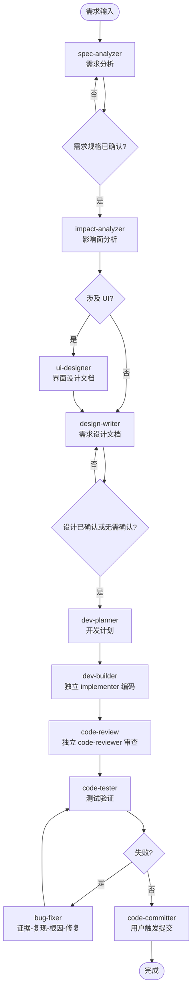

# DevFlow - AI 原生迭代开发工作流

DevFlow 是一套可复制到项目中的 Claude Code 开发工作流。目标是让 AI 面向日常迭代稳定完成开发：不偏离需求、不遗漏影响面、不过度开发，并能在中断后继续执行。

核心用法：

```text
复制 .claude 到目标项目根目录
打开 Claude Code
Claude 会先恢复状态，并主动询问是否开始或继续需求开发
```

完整调度规则在 `.claude/CLAUDE.md`，本文档面向人类快速理解。

---

## 一句话定位

```text
按需求项分析，按需求输入协调；用需求设计文档想清楚，用开发计划逐任务执行，用独立子 Agent 控制编码和审查上下文。
```

DevFlow 解决的是 AI 开发的三个核心问题：

- **不偏离需求**：每个任务绑定需求项、验收标准、设计依据和审查结果。
- **不遗漏影响**：编码前先做影响面分析，涉及 UI 时必须有界面契约。
- **不过度开发**：任务只允许改计划内范围，低置信度和未决问题不能进入编码。

第一版不引入进化系统，不做自动规则升级，优先保证流程轻量、可执行、可恢复。

---

## 核心对象

| 对象 | 说明 |
|------|------|
| 需求输入 | 用户的一份需求文档、Issue、截图说明、口头需求或一次迭代输入 |
| 迭代需求文档 | `spec-analyzer` 输出的结构化需求分析结果 |
| 需求项 | 最小分析、设计、开发、验收单位，可独立追踪 |
| 需求设计文档 | `design-writer` 输出的详细设计，按一次需求输入成文，内部包含多个需求项 |
| 界面设计文档 | `ui-designer` 输出的 UI 稿解析、界面契约和前端实现设计 |
| 编码上下文 | 需求设计文档中的编码边界章节，不单独落盘 |
| 开发计划 | `dev-planner` 输出的任务序列和状态记录，支持中断后继续 |
| 审查状态 | `.claude/.review-status.json`，由 `code-review` 写入，记录结论、覆盖范围和代码内容哈希，供提交前检查使用 |

---

## 主流程



---

## 复杂度等级

| 中文等级 | 内部等级 | 典型条件 | 流程深度 |
|----------|----------|----------|----------|
| 微 | XS | 极小、零歧义、不改接口/数据/行为链路 | 可跳过详细设计，由 `dev-builder` 临时组装编码输入 |
| 小 | S | 单模块轻量变更，有少量交互或流程需约束 | 轻量影响面 + 必要设计 + 开发计划 |
| 中 | M | 多模块、可能涉及接口/数据/UI 状态 | 完整影响面 + 需求设计文档 + 开发计划 |
| 大 | L | 跨模块/跨工程/协议/数据模型/不可回滚变更 | 完整设计 + 风险确认 + 加深测试和审查 |

聚合风险不改变单个需求项级别，但会影响开发计划、测试范围和审查重点。

需求实际涉及线程、并发、缓存、资源生命周期或性能时，需求设计必须形成明确运行时约束；不涉及时只标记“不涉及”。中/大需求以及涉及关键运行时、兼容、迁移、UI 或不可逆决策的小需求，在生成开发计划前需要用户确认设计。

---

## 中断恢复

DevFlow 支持中断后继续，但依赖文件化状态。

新 AI 窗口恢复时应读取：

1. `.claude/progress.json`：当前迭代、当前 Skill、当前步骤、关键里程碑。
2. `docs/08-计划/<需求迭代编号>-<需求主题>开发计划.md`：任务状态和执行记录。
3. `docs/02-需求/<需求迭代编号>-<需求主题>需求.md`：已确认的需求规格。
4. `docs/04-设计/需求设计/<需求迭代编号>-<需求主题>需求设计.md`：需求设计和编码上下文。
5. `docs/05-UI/<需求迭代编号>-<需求主题>界面设计.md`：界面契约，如涉及 UI。
6. `.claude/.review-status.json`：最近一次审查范围和结论。
7. 测试报告或当前会话测试结论。

如果 `progress.json` 为空，新窗口应扫描 `docs/08-计划` 找最近开发计划，以任务状态为准恢复。

开发计划中的任务状态是恢复核心：

```text
待执行 / 执行中 / 已完成 / 阻塞 / 跳过
```

---

## 调度与恢复原则

DevFlow 按需调度，不机械执行完整流水线。已有需求设计就继续计划，已有开发计划就按任务状态继续，代码已变更则优先审查和测试。

需求规格未确认，或存在会影响方向、范围、验收的待确认问题时，不进入影响面分析。

开发计划记录基线提交和迭代开始时已有变更；无法证明属于当前需求的用户原有改动，不自动纳入任务、审查或提交范围。

如果中途打开新 AI 窗口，先读取 `.claude/progress.json`；若索引为空，则扫描 `docs/08-计划`，以开发计划中的任务状态恢复。

执行中任务优先：除非用户明确要求停止或切换，否则先完成当前编码、审查或测试任务，避免半成品和状态错乱。

项目加载完成后，如果用户没有给出明确任务，DevFlow 应主动询问是否开始新需求、继续上次迭代，或切换到需求分析、详细设计、开发、审查、测试、提交等阶段。

---

## 产物路径

| 产物 | 路径 |
|------|------|
| 需求规格 | `docs/02-需求/<需求迭代编号>-<需求主题>需求.md` |
| 影响面分析 | `docs/02-需求/<需求迭代编号>-<需求主题>影响面.md` |
| 需求设计 | `docs/04-设计/需求设计/<需求迭代编号>-<需求主题>需求设计.md` |
| 模块设计 | `docs/04-设计/模块设计/<模块名>.md` |
| 架构设计 | `docs/01-总览/架构总览.md` |
| UI 设计 | `docs/05-UI/<需求迭代编号>-<需求主题>界面设计.md` |
| 开发计划 | `docs/08-计划/<需求迭代编号>-<需求主题>开发计划.md` |
| 测试报告 | `docs/06-测试/<需求迭代编号>-<需求主题>测试报告.md` |

多工程仓库可将工程级文档放在 `projects/<工程>/docs/`对应模块路径下。模块设计属于详细设计沉淀，仅在产生长期稳定事实时回写；没有模块文档时，先参考现有 `docs` 下的模块资料，没有资料再基于图谱和代码证据创建模块描述骨架。

---

## Skill 与 Agent

| 阶段 | Skill / Agent |
|------|---------------|
| 需求分析 | `spec-analyzer` |
| 影响面分析 | `impact-analyzer` |
| UI 稿解析与前端设计 | `ui-designer` |
| 详细设计 | `design-writer` |
| 开发计划 | `dev-planner` |
| 编码调度 | `dev-builder` |
| 编码执行 | `agents/implementer.md` |
| 代码审查 | `code-review` |
| 审查执行 | `agents/code-reviewer.md` |
| 测试验证 | `code-tester` |
| Bug 修复 | `bug-fixer` |
| 提交辅助 | `code-committer` |

---

## Hooks

Claude Code 的 `Stop` 表示当前回复结束，不代表编码完成。DevFlow 不使用 Stop hook 作为审查门禁，避免阻断需求确认、阶段汇报和等待用户输入。

Git hooks 在 DevFlow 初始化时启用。AI 加载项目或执行 `code-committer` 时，应检查当前仓库配置；若未设置，则自动执行：

```powershell
git config core.hooksPath .claude/hooks
```

启用后：

- `pre-commit` 先调用 `review-check.ps1`，校验暂存代码均已审查且内容未在审查后变化。
- `pre-commit` 再调用 `pre-commit-check.ps1`，执行编译检查；失败会阻止提交并路由到 `bug-fixer`。
- DevFlow 不提供 post-commit 自动 push。推送只由用户明确要求时通过 `code-committer` 执行。

---

## 即插即用约定

DevFlow 只要求复制 `.claude` 目录。目标项目的需求、设计、计划、测试报告会在该项目自己的 `docs/...` 规范目录下生成。

本仓库不保留样例 `docs`，避免复制时污染目标项目。

